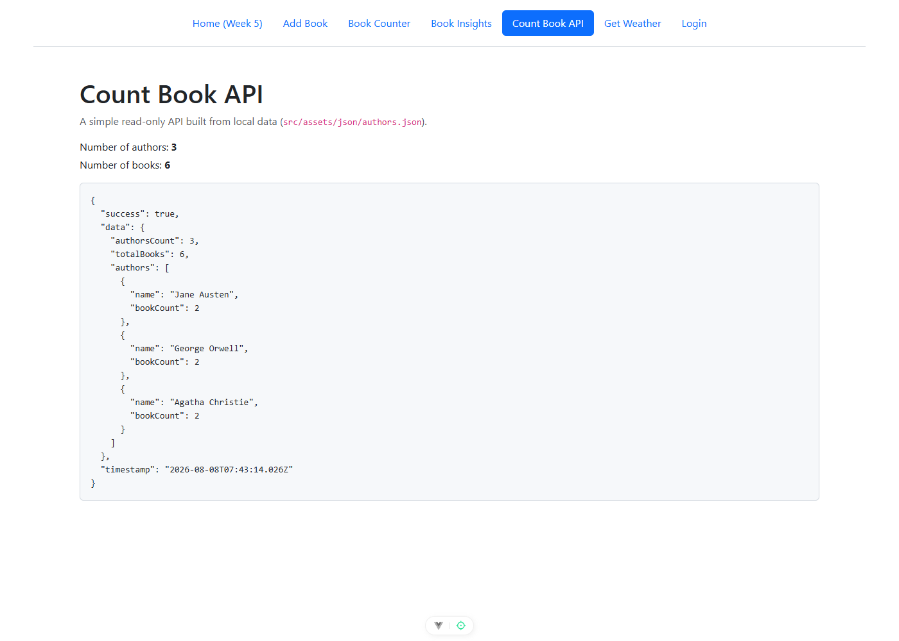
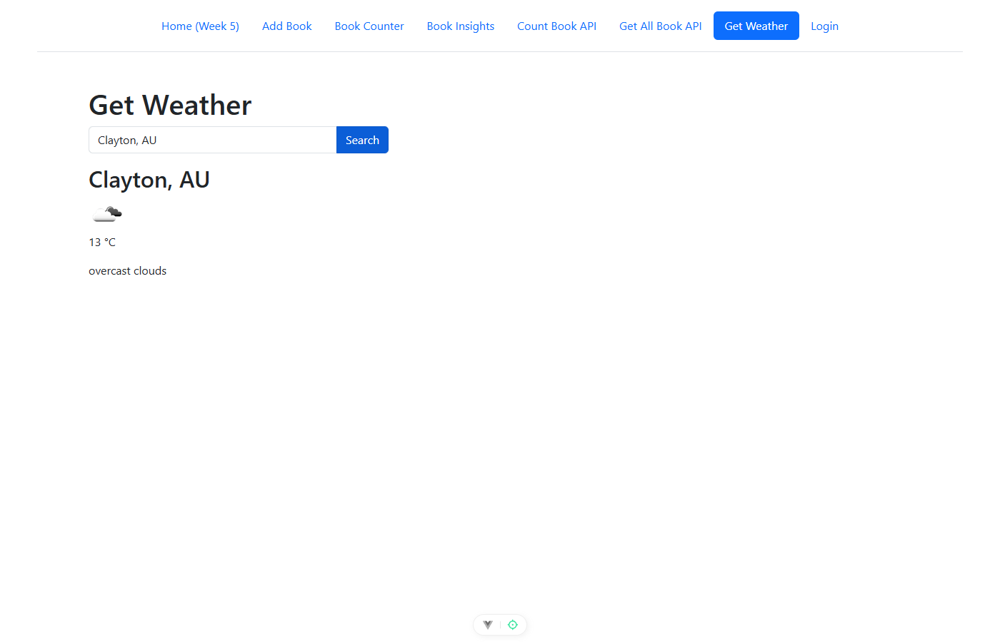
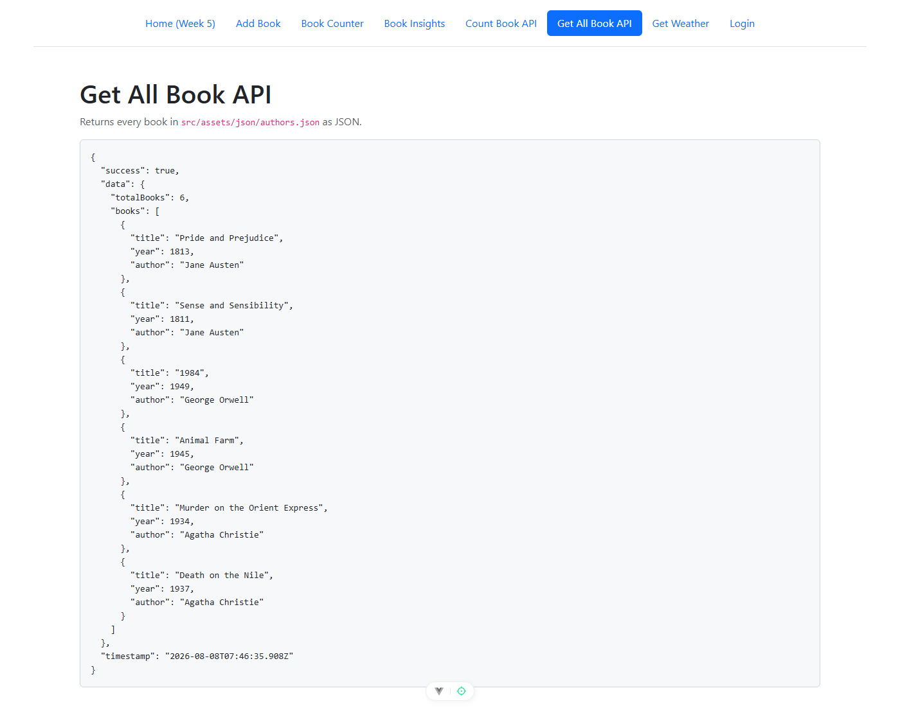

# FIT5032 Lab 10 Report — Working with APIs

| | |
|---|---|
| **Name** | [ FILL IN ] |
| **Student ID** | [ FILL IN ] |
| **Tutorial** | [ FILL IN ] |
| **Date** | [ FILL IN ] |
| **Branch** | `lab10-api` |
| **Repository** | https://github.com/rikey123123/rwang-library-lab5/tree/lab10-api |

---

## 1. Overview

This lab adds two kinds of API integration to the existing Vue 3 library
application:

1. **An external API** — current weather data from
   [OpenWeatherMap](https://openweathermap.org/current), consumed with `axios`.
2. **Two "own" APIs built from local data** — pages that read
   `src/assets/json/authors.json` and return an API-style JSON response.

Four features were implemented in total, covering both Task 10.1 (Pass/Credit)
and Task 10.2 (D/HD):

| # | Feature | Task | Page |
|---|---|---|---|
| 1 | Weather for the current location (geolocation) | 10.1 | `/WeatherCheck` |
| 2 | Search weather by city name | 10.2 | `/WeatherCheck` |
| 3 | Count of authors and books | 10.1 | `/CountBookAPI` |
| 4 | All books in JSON format | 10.2 | `/GetAllBookAPI` |

Features 1 and 2 live on the same page, so a single code screenshot covers both.

### Routes and navigation

Three routes were registered in `src/router/index.js`:

| Path | Route name | Component |
|---|---|---|
| `/WeatherCheck` | `GetWeather` | `WeatherView.vue` |
| `/CountBookAPI` | `CountBookAPI` | `CountBookAPI.vue` |
| `/GetAllBookAPI` | `GetAllBookAPI` | `GetAllBookAPI.vue` |

Matching hyperlinks ("Get Weather", "Count Book API", "Get All Book API") were
added to the navigation bar in `src/components/BHeader.vue`.

---

## 2. Task 10.1 — Pass and Credit

### 2.1 Current location weather

`src/views/WeatherView.vue` uses the Options API. On `mounted()` it calls
`fetchCurrentLocationWeather()`, which asks the browser for the user's
coordinates via `navigator.geolocation.getCurrentPosition()` and then requests
the OpenWeatherMap current-weather endpoint with those coordinates:

```js
navigator.geolocation.getCurrentPosition(
  async (position) => {
    const { latitude, longitude } = position.coords
    await this.fetchWeatherData(`${BASE}?lat=${latitude}&lon=${longitude}&appid=${apikey}`)
  },
  () => {
    this.statusMessage = 'Location permission denied. Please allow location access.'
  }
)
```

The response is stored in `weatherData` and rendered through two computed
properties:

- `temperature` converts the default Kelvin reading to Celsius with
  `Math.floor(this.weatherData.main.temp - 273)`.
- `iconUrl` builds the icon URL from the response's icon code.

**Figure 1 — `WeatherView.vue` source code**

*This screenshot covers both Task 10.1 (`fetchCurrentLocationWeather`) and
Task 10.2 (`searchByCity`), since both methods are in the same file.*

[ PLACEHOLDER: Figure 1 — VS Code showing WeatherView.vue, with both
fetchCurrentLocationWeather() and searchByCity() visible ]

**Figure 2 — Browser showing weather for the current location**

[ PLACEHOLDER: Figure 2 — http://localhost:5179/WeatherCheck on page load,
showing the detected city, temperature in °C and the weather icon ]

### 2.2 Number of authors and books

`src/views/CountBookAPI.vue` uses the Composition API (`<script setup>`). It
fetches the local authors file, then aggregates it:

```js
const calculateStats = () => {
  authorsCount.value = authors.value.length
  totalBooks.value = authors.value.reduce((total, author) => {
    return total + author.famousWorks.length
  }, 0)
}
```

The page then exposes an API-style envelope containing `authorsCount`,
`totalBooks`, a per-author breakdown, and a timestamp, rendered with
`JSON.stringify(apiResponse, null, 2)`.

`authors.json` contains 3 authors with 2 famous works each, so the expected
result is **3 authors and 6 books**.

**Figure 3 — `CountBookAPI.vue` source code**

[ PLACEHOLDER: Figure 3 — VS Code showing CountBookAPI.vue, with
calculateStats(), getApiData() and the apiResponse object visible ]

**Figure 4 — Browser showing the number of authors and books**



The rendered JSON reports `"authorsCount": 3` and `"totalBooks": 6`, matching
the source data.

---

## 3. Task 10.2 — Distinction and High Distinction

### 3.1 Search weather by city

The same `WeatherView.vue` page contains a text field bound with
`v-model="city"` and a **Search** button bound to `searchByCity`:

```js
async searchByCity() {
  if (!this.city) return
  await this.fetchWeatherData(`${BASE}?q=${this.city}&appid=${apikey}`)
}
```

Both `fetchCurrentLocationWeather()` and `searchByCity()` delegate to the same
`fetchWeatherData(url)` helper, so the city search reuses the existing Celsius
conversion and weather-icon rendering without duplication.

The source code for this method is shown in **Figure 1** above.

**Figure 5 — Browser showing weather searched by city**



Typing `Clayton, AU` and clicking **Search** returns `Clayton, AU`, `13 °C` and
the `overcast clouds` icon. The Celsius value matches the raw API reading of
`286.48` K (`286.48 − 273 = 13`), and the icon image was confirmed to have
actually loaded rather than rendering as a broken image.

### 3.2 All books in JSON format

`src/views/GetAllBookAPI.vue` flattens every author's `famousWorks` array into
a single list of books:

```js
const books = authors.flatMap((author) =>
  author.famousWorks.map((work) => ({
    title: work.title,
    year: work.year,
    author: author.name
  }))
)
```

Each book therefore carries its title, publication year and author name. The
result is wrapped in the same API-style envelope and printed as formatted JSON.

**Figure 6 — `GetAllBookAPI.vue` source code**

[ PLACEHOLDER: Figure 6 — VS Code showing GetAllBookAPI.vue, with the flatMap
call and the apiResponse object visible ]

**Figure 7 — Browser showing all books in JSON format**



All 6 books are returned with complete `title`, `year` and `author` fields, and
`totalBooks` agrees with the count produced independently by `/CountBookAPI`.

---

## 4. Design decisions and deviations from the tutorial

The tutorial code was followed closely. Four deliberate changes were made, each
for a concrete reason.

| # | Tutorial | This implementation | Reason |
|---|---|---|---|
| 1 | `fetch('src/assets/json/authors.json')` | `fetch('/src/assets/json/authors.json')` | The relative path happens to resolve correctly from `/CountBookAPI`, but would break from any nested route. The leading slash makes it deterministic. Verified that the Vite dev server returns this file with `Content-Type: application/json`. |
| 2 | `const apikey = "..."` hardcoded | `import.meta.env.VITE_OPENWEATHER_API_KEY` | The repository is public. A hardcoded key would be committed to GitHub. The key lives in `.env.local`, which `.gitignore` excludes via the `*.local` rule. |
| 3 | `http://api.openweathermap.org/...` | `https://api.openweathermap.org/...` | Browsers block mixed (HTTP) content on HTTPS pages, so the HTTP endpoint would fail once the app is deployed. |
| 4 | `http://api.openweathermap.org/img/w/{icon}.png` | `https://openweathermap.org/img/w/{icon}.png` | Same mixed-content reason. |

`Math.floor(temp - 273)` was kept as written in the tutorial rather than
switching to the `units=metric` query parameter, since the tutorial presents the
latter only as an optional alternative.

### Data source for `GetAllBookAPI`

Task 10.2 asks for "all books in JSON format". Two data sources were available:
the Cloud Firestore `books` collection built in Lab 8, and the local
`authors.json` file used by §10.3 of this tutorial.

`authors.json` was chosen because Lab 10 is explicitly about building an API
from **local data**, it requires no authentication or network access, and it
keeps `/CountBookAPI` and `/GetAllBookAPI` consistent — both report 6 books
from the same source, which makes the two pages cross-verifiable.

---

## 5. Verification

Each feature was checked against its underlying data rather than by eye alone.

| Feature | How it was verified | Result |
|---|---|---|
| Count authors and books | Compared the rendered JSON against the counts computed directly from `authors.json` with Node | `authorsCount: 3`, `totalBooks: 6` — match |
| All books JSON | Parsed the rendered JSON and asserted every entry has `title`, `year` and `author` | 6/6 books complete |
| `authors.json` fetch | Captured the browser's network response for the file | `200 OK` |
| Weather request URLs | Ran the page with a mocked browser geolocation and inspected the outgoing requests | Both `?lat=…&lon=…` and `?q=Clayton, AU` built correctly |
| Search weather by city | Compared the rendered values against the raw API response fetched independently with `curl` | `Clayton, AU`, `13 °C`, `overcast clouds` — match (`286.48 K − 273 = 13`) |
| Weather icon | Checked `img.complete && img.naturalWidth > 0` in the browser | Icon `04n.png` loaded successfully |

---

## 6. Problems encountered and fixes

| Problem | Cause | Fix |
|---|---|---|
| Uncertain whether the tutorial's `fetch('src/...')` path works under Vite | Vite normally converts `.json` into an ES module when imported, which would break `response.json()` | Requested the URL directly against the dev server and confirmed it returns raw JSON with `Content-Type: application/json`; changed to an absolute path for robustness |
| `401 Invalid API key` immediately after signing up | OpenWeatherMap does not activate new keys instantly | Confirmed the key format (32 hex characters) was correct, then waited. The key began returning `200` roughly 25 minutes after registration. |
| New API key not picked up by the running app | Vite reads `.env.local` only at startup, not on hot reload | Restarted the dev server |

---

## 7. Status

| Task | Requirement | Status |
|---|---|---|
| 10.1 | Current location weather | Complete |
| 10.1 | Number of authors and books | Complete |
| 10.2 | Search weather by city | Complete |
| 10.2 | All books in JSON at `GetAllBookAPI` | Complete |

---

## 8. Files changed

| File | Change |
|---|---|
| `src/views/WeatherView.vue` | New — current location weather and search by city |
| `src/views/CountBookAPI.vue` | New — counts authors and books, returns JSON |
| `src/views/GetAllBookAPI.vue` | New — returns all books as JSON |
| `src/router/index.js` | Added `/WeatherCheck` (name `GetWeather`), `/CountBookAPI`, `/GetAllBookAPI` |
| `src/components/BHeader.vue` | Added "Get Weather", "Count Book API", "Get All Book API" navigation links |
| `.env.local` | New, git-ignored — holds the OpenWeatherMap API key |
