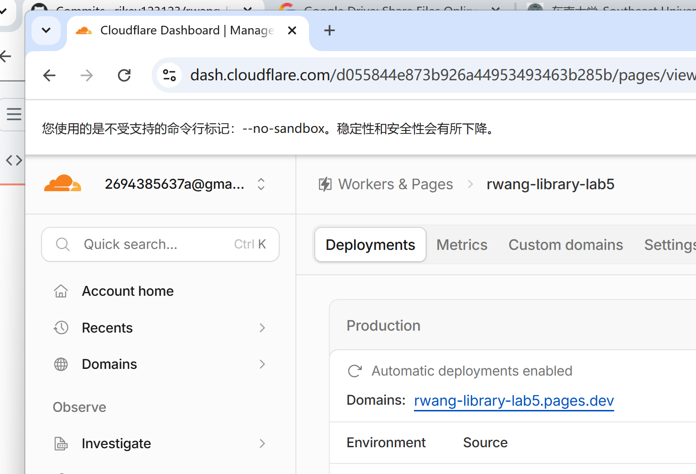
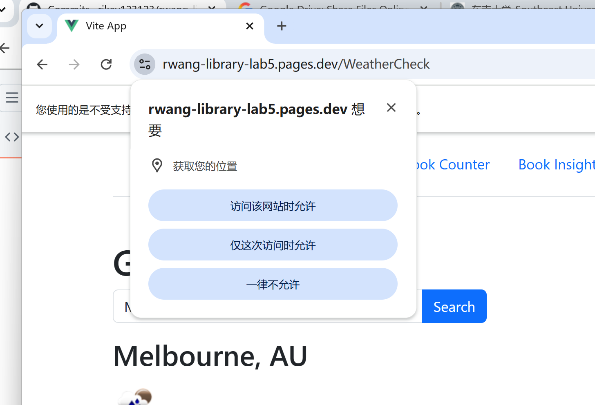

# FIT5032 – Assessed Lab 11 Report

**Student Name:** Ruiqi Wang
**Student ID:** 36668095
**Tutorial:** [ FILL IN ]
**Date:** 8 August 2026

**Repository:** https://github.com/rikey123123/rwang-library-lab5/tree/lab11-deployment
**Deployed application:** https://rwang-library-lab5.pages.dev

---

## 1. Overview

Lab 11 deploys the Vue 3 single-page application built across Labs 5–10 to
**Cloudflare Pages**, and verifies that the `Get Weather` feature (route
`/WeatherCheck`, added in Lab 10) continues to work in the deployed
production environment rather than only on the local dev server.

| Deliverable | Task | Evidence |
|---|---|---|
| Public `*.pages.dev` URL | 11.1 | Section 2 |
| Cloudflare production deployment succeeded | 11.1 | Figure 1 |
| `Get Weather` works on the deployed site | 11.2 | Figure 2 |

Cloudflare Pages builds and hosts the **front end only**. This application
needs no separate backend deployment: the weather feature calls the
OpenWeatherMap public HTTPS API directly from the browser, and Labs 7–9
use Firebase (Authentication, Firestore, Cloud Functions), which is already
hosted by Google. There is therefore no `localhost` backend dependency to
migrate.

---

## 2. Task 11.1 — Cloudflare Pages deployment

### 2.1 Deployed link

**https://rwang-library-lab5.pages.dev**

The `Get Weather` page is reachable directly at
**https://rwang-library-lab5.pages.dev/WeatherCheck**

### 2.2 Build configuration used

| Setting | Value | Why |
|---|---|---|
| Repository | `rikey123123/rwang-library-lab5` | Contains a single Vue project at the repository root |
| Production branch | `lab11-deployment` | See Section 4.1 — `main` does not contain the weather feature |
| Framework preset | `Vue` | Vite-based Vue 3 project |
| Build command | `npm run build` | `package.json` → `"build": "vite build"` |
| Build output directory | `dist` | Vite's default output directory |
| Node version | `22` (via `.node-version`) | See Section 4.3 |
| Build environment variable | `VITE_OPENWEATHER_API_KEY` | See Section 4.2 — **required**, or the weather feature returns HTTP 401 |

Selecting the `Vue` framework preset auto-populated the build command
(`npm run build`) and output directory (`dist`), which matched the values this
project requires.

The deployed production build corresponds to commit
[`88ce3f5`](https://github.com/rikey123123/rwang-library-lab5/commit/88ce3f5274907dbc4b94fdcbf323170dd710cdff)
on branch `lab11-deployment`, and Cloudflare reports *Automatic deployments
enabled*, so subsequent pushes to that branch redeploy automatically.

### 2.3 Evidence

**Figure 1 — Cloudflare Pages production deployment**



---

## 3. Task 11.2 — `Get Weather` working on the deployed site

The `/WeatherCheck` route exposes two weather lookups implemented in Lab 10:
an automatic current-location lookup via `navigator.geolocation` on mount,
and a city-name search. Both call the OpenWeatherMap current-weather
endpoint over HTTPS and render city, country, temperature in °C, a weather
icon, and a text description.

**Figure 2 — `Get Weather` working on the deployed Cloudflare Pages site**



The screenshot was taken on the deployed site, not on the local dev server:
the address bar shows `https://rwang-library-lab5.pages.dev/WeatherCheck`. A
city search for `Melbourne, AU` returned `12 °C` with the description
`light rain` and the matching weather icon.

The `Get Weather` functionality is working successfully on the deployed
Cloudflare Pages application.

---

## 4. Design decisions and deviations

### 4.1 Production branch is `lab11-deployment`, not `main`

Each lab in this unit was developed on its own branch. The weather feature
(`src/views/WeatherView.vue`, route `/WeatherCheck`) was added in Lab 10 on
branch `lab10-api` and was **never merged into `main`** — verified with:

```
git ls-tree -r --name-only main | grep -i weather     # no matches
git log --oneline main..lab10-api | wc -l             # 23 commits ahead
```

Deploying `main` would therefore have produced a site where `/WeatherCheck`
does not exist, making Task 11.2 impossible. Branch `lab11-deployment` was
created from `lab10-api` so that the deployed site contains the complete
application. Cloudflare Pages allows any branch to be designated the
production branch, so this required no change to the repository's default
branch.

### 4.2 The API key is supplied as a Cloudflare build variable, not committed

`WeatherView.vue` reads the key through Vite's env mechanism:

```js
const apikey = import.meta.env.VITE_OPENWEATHER_API_KEY
```

The key lives only in `.env.local`, which is git-ignored (`.gitignore:15` →
`*.local`), so it is deliberately absent from the repository. Vite inlines
`VITE_*` variables **at build time**, so the variable must be configured in
Cloudflare's project settings before the production build runs. If it is
added after the first deployment, a redeploy is required for it to take
effect.

**Security note:** because Vite inlines the value into the JavaScript bundle,
the key is readable by anyone who inspects the deployed site's assets. This
was confirmed locally:

```
grep -F "$VITE_OPENWEATHER_API_KEY" dist/assets/*.js   # match found
```

This is inherent to calling a third-party API directly from a front-end SPA
and is acceptable for a low-privilege, rate-limited teaching key. A
production system would proxy the call through a backend or a Cloudflare
Worker and keep the secret server-side.

### 4.3 Two files added specifically for Cloudflare Pages

| File | Contents | Reason |
|---|---|---|
| `public/_redirects` | `/*    /index.html   200` | The router uses `createWebHistory()` (`src/router/index.js:76`). Without a rewrite rule, requesting `https://<project>.pages.dev/WeatherCheck` directly asks Cloudflare's static host for a file at that path, which does not exist → HTTP 404. The rule serves `index.html` for every path so Vue Router resolves the route client-side. |
| `.node-version` | `22` | The local toolchain runs Node v24.11.1, which is not guaranteed to be available in Cloudflare's build image. Pinning Node 22 LTS keeps the build reproducible and compatible with Vite 5. |

Both are additive; neither changes application behaviour locally.

---

## 5. Verification

Before deploying, the production **build output** (`dist/`, the exact bytes
Cloudflare serves) was verified locally by serving it with `npm run preview`
and driving a real browser against it. This confirms any deployment failure
is a configuration problem rather than a code problem.

### 5.1 Before deploying — verified against the local production build

| Check | Method | Result |
|---|---|---|
| Production build succeeds | `npm run build` | ✅ 279 modules, built in 3.23s, `dist/` created |
| `_redirects` reaches the deployed output | `ls dist/` after build | ✅ `dist/_redirects` present |
| `/WeatherCheck` resolves on direct load | Load `http://localhost:4173/WeatherCheck` in a real browser | ✅ `<h1>` = `Get Weather` |
| Weather data retrieved from the built bundle | City search for `Clayton, AU` | ✅ `Clayton, AU` / `12 °C` / `overcast clouds` |
| Weather icon actually rendered (not a broken image) | `img.complete && img.naturalWidth` | ✅ `complete: true`, `naturalWidth: 50`, `https://openweathermap.org/img/w/04n.png` |
| No error surfaced to the user | Read the status-message element | ✅ empty |
| API key absent from the repository | `git grep -F "<key>" HEAD` | ✅ no match |
| `.env.local` not tracked | `git check-ignore -v .env.local` | ✅ ignored via `*.local` |

### 5.2 After deploying — verified against the live site

These checks were run against `https://rwang-library-lab5.pages.dev`, so they
verify the deployed artefact and the Cloudflare configuration, not the local
machine.

| Check | Method | Result |
|---|---|---|
| Site is publicly reachable | Loaded the deployed URL in a browser | ✅ served |
| `/WeatherCheck` resolves on **direct** URL entry (not via nav click) | Navigated straight to `https://rwang-library-lab5.pages.dev/WeatherCheck` | ✅ no 404 — `_redirects` works in production |
| The build received the API key | Inspected the outgoing request | ✅ `…&appid=e4e0…9f34` — a real key, not `undefined` |
| Weather API call succeeds in production | Network log for the city search | ✅ `GET api.openweathermap.org/data/2.5/weather?q=Melbourne,%20AU&appid=…` → **200 OK** |
| Weather renders on the page | Read the live DOM | ✅ `Melbourne, AU` / `12 °C` / `light rain` |
| Weather icon actually rendered | `img.complete && img.naturalWidth` | ✅ `complete: true`, `naturalWidth: 50`, `https://openweathermap.org/img/w/10n.png` |
| No error shown to the user | Read the status-message element | ✅ empty |

Browser verification was performed with a headed Chromium driven through
Playwright, so the values above were read from the live DOM and the live
network log rather than asserted by hand.

---

## 6. Problems encountered and fixes

| # | Problem | Cause | Fix |
|---|---|---|---|
| 1 | Deploying `main` would give a 404 on `/WeatherCheck` | The weather feature was only ever committed to `lab10-api`; `main` is 23 commits behind and has no `WeatherView.vue` | Created and deployed branch `lab11-deployment` from `lab10-api` (Section 4.1) |
| 2 | Direct access to `/WeatherCheck` returns 404 on a static host | Vue Router history mode requires a server-side rewrite; a static host looks for a real file at that path | Added `public/_redirects` with `/*    /index.html   200` (Section 4.3) |
| 3 | Weather would fail in production with HTTP 401 even though it works locally | `.env.local` is git-ignored, so Cloudflare's build has no `VITE_OPENWEATHER_API_KEY`; the request is sent with `appid=undefined` | Configured the variable in Cloudflare project settings as a build variable (Section 4.2) |
| 4 | Risk of the Cloudflare build failing on an unexpected Node version | Local Node is v24, which may not exist in Cloudflare's build image | Pinned Node 22 LTS via `.node-version` (Section 4.3) |

---

## 7. Status

| Task | Requirement | Status |
|---|---|---|
| 11.1 | Deployed project link | ✅ https://rwang-library-lab5.pages.dev |
| 11.1 | Cloudflare deployment screenshot | ✅ Figure 1 |
| 11.2 | `Get Weather` works on the deployed site | ✅ verified — Section 5.2 |
| 11.2 | Screenshot including the address bar | ✅ Figure 2 |
| — | Production build verified locally | ✅ Section 5.1 |
| — | Live site verified after deployment | ✅ Section 5.2 |
| — | SPA routing fallback added | ✅ `public/_redirects` |
| — | Node build version pinned | ✅ `.node-version` |
| — | API key kept out of the repository | ✅ verified |

---

## 8. Files changed

| File | Change |
|---|---|
| `public/_redirects` | **new** — SPA history-mode rewrite for Cloudflare Pages |
| `.node-version` | **new** — pin Node 22 LTS for the Cloudflare build image |
| `LAB11_REPORT.md` / `README.md` | **new** — this report |
| `lab11report/assets/111-cloudflare-deployment.png` | **new** — Figure 1 |
| `lab11report/assets/112-weathercheck-deployed.png` | **new** — Figure 2 |

No application source file was modified for this lab; the deployment
required only host configuration and the two additive files above.
