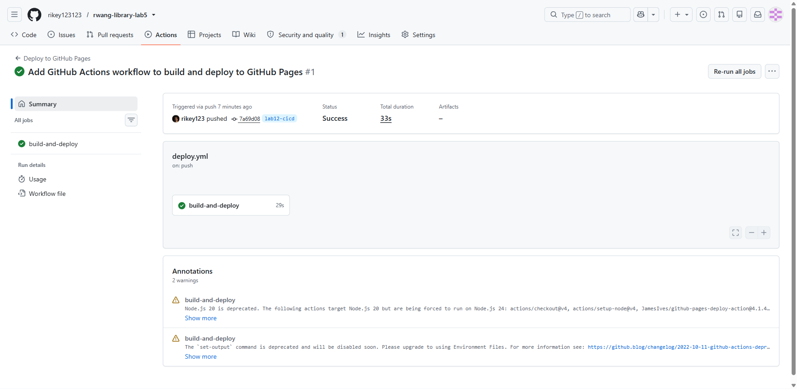

# FIT5032 – Assessed Lab 12 Report

**Student Name:** Ruiqi Wang
**Student ID:** 36668095
**Tutorial:** [ FILL IN ]
**Date:** 8 August 2026

**Repository:** https://github.com/rikey123123/rwang-library-lab5/tree/lab12-cicd
**Deployed application:** https://rikey123123.github.io/rwang-library-lab5/

---

## 1. Overview

Lab 12 has two independent tasks:
- **Task 12.1** — deploy the Vue 3 SPA to GitHub Pages via a CI/CD workflow
  (GitHub Actions), and provide the deployed link plus a screenshot of the
  successful workflow run.
- **Task 12.2** — research and write two short answers on web performance and
  security: Time To First Byte (TTFB) and hotlinking.

Both tasks are combined into a single PDF submission.

---

## 2. Task 12.1 — CI/CD with GitHub Actions

### 2.1 Deployed project link

**https://rikey123123.github.io/rwang-library-lab5/**

The `Get Weather` page is at
[https://rikey123123.github.io/rwang-library-lab5/WeatherCheck](https://rikey123123.github.io/rwang-library-lab5/WeatherCheck)

### 2.2 Build configuration

| Setting | Value | Why |
|---|---|---|
| CI/CD platform | GitHub Actions | Required by the task; free for public repos |
| Trigger | Push to `lab12-cicd` | See Section 4.1 — `main` does not contain the full app |
| Node version | 20 (LTS) | Reproducible build environment |
| Build command | `npm run build` | Vite-based Vue 3 project |
| Deploy target | `gh-pages` branch | Via `JamesIves/github-pages-deploy-action@4.1.4` |
| API key | `VITE_OPENWEATHER_API_KEY` secret | Required — injected at build time |
| `base` | `'/rwang-library-lab5/'` | GitHub Pages serves from a sub-path, not the domain root |
| Router history | `createWebHistory(import.meta.env.BASE_URL)` | Vite `base` → router `BASE_URL` |
| SPA fallback | `cp dist/index.html dist/404.html` | GitHub Pages serves `404.html` for unknown paths, allowing Vue Router to resolve deep links client-side |

Selecting the Vue framework preset was not applicable here — GitHub Actions
uses a hand-written workflow (`.github/workflows/deploy.yml`) rather than a
pre-configured build template. The workflow is modelled on the unit handout
but adjusted for this project (Vite rather than Vue CLI, a sub-path `base`
rather than `vue.config.js`, and the API key secret).

### 2.3 Evidence

**Figure 1 — Successful GitHub Actions CI/CD workflow**



The screenshot shows the Actions run for commit `7a69d08` on branch
`lab12-cicd`, with the `build-and-deploy` job completing successfully in
29 seconds. The deployed artefact is published to the `gh-pages` branch and
served at the link above.

### 2.4 Live verification

| Check | Method | Result |
|---|---|---|
| Root URL serves the app | `curl -s -o /dev/null -w "%{http_code}"` | ✅ HTTP 200 |
| JS / CSS assets resolve at the sub-path | Direct URL load in a real browser | ✅ both 200 |
| Deep link `/WeatherCheck` renders correctly | Navigated in a headed Chromium | ✅ `Get Weather` heading visible |
| Weather search works (API key present) | City search for `Melbourne, AU` in a real browser | ✅ `Melbourne, AU 12 °C overcast clouds` |
| SPA routing survives direct URL entry | Navigated to `/WeatherCheck` from the address bar | ✅ 404.html fallback → Vue Router resolves |

---

## 3. Task 12.2 — Research answers

### Text Answer 1 — Time To First Byte (TTFB)

Time To First Byte (TTFB) is a web performance metric that measures the
duration between a browser initiating a request for a page and receiving the
first byte of the response from the server. It is composed of several stages:
redirect time (if any), DNS lookup, TCP connection establishment, TLS
negotiation, and the server's processing time before it begins sending data.
Because the browser cannot start parsing or rendering until the initial
response arrives, a high TTFB directly delays every downstream metric,
including First Contentful Paint (FCP) and Largest Contentful Paint (LCP).

There are several practical strategies for reducing TTFB:

1. **Reduce server-side processing time.** Optimise application code, database
   queries, and server-side rendering logic so the server can respond quickly.
2. **Use caching.** Serve frequently requested or static content from a cache
   (in-memory, on-disk, or at a reverse proxy) so the server does not
   regenerate identical responses for every request.
3. **Deploy a Content Delivery Network (CDN).** A CDN caches content at edge
   locations close to users, cutting the round-trip latency that dominates
   TTFB for geographically distant visitors.
4. **Choose appropriate hosting.** An under-provisioned server or a shared
   hosting plan with noisy neighbours can add hundreds of milliseconds of
   queuing delay before any application code runs.
5. **Eliminate unnecessary redirects.** Every redirect adds a full
   request–response cycle, so landing-page URLs should resolve directly.
6. **Upgrade network infrastructure.** Modern protocols (HTTP/2, HTTP/3) and
   keeping DNS and TLS configurations current reduce the connection-setup
   portion of TTFB.

For static sites, the most effective measures are a CDN with edge caching and
a fast DNS provider, because there is no dynamic server-side work to optimise.
The web.dev guidance suggests that most sites should aim for a TTFB of
**0.8 seconds or below** (Pollard & Wagner, 2025).

### Text Answer 2 — Hotlinking

Hotlinking is the practice of displaying a resource — most commonly an image —
on one website by embedding a direct URL that points to the file hosted on
another website, rather than hosting a copy of the file locally. For example,
if Website B writes ``, every visitor
to Website B downloads `photo.jpg` from `example.com`'s server. Website B gets
the image on its page at zero hosting cost, while `example.com` pays for the
bandwidth and server resources without receiving any of the traffic or
page-views.

Hotlinking can be prevented through several techniques:

1. **HTTP Referer header checking.** The web server or a reverse proxy
   inspects the `Referer` header on incoming requests for protected resources.
   If the referer is absent or belongs to an unauthorised external domain, the
   request is rejected (typically with an HTTP 403 response). This can be
   configured in Apache (`.htaccess`), Nginx, or through a CDN's rule engine.

2. **CDN-level hotlink protection.** Services such as Cloudflare provide
   built-in hotlink protection that checks the referring site and blocks
   external domains from embedding protected images (Cloudflare, 2026).

3. **Signed or time-limited URLs.** The server generates a unique token
   (e.g. an HMAC-signed expiry timestamp) appended to the resource URL. When
   the token expires or is absent, the request is denied. This is stronger
   than referer checking because it does not rely on the browser honestly
   reporting the referer.

4. **Authenticated access.** Resources are served only after the user
   authenticates, so knowing the URL alone is insufficient.

Hotlink protection must be configured with care. Overly restrictive rules can
block legitimate referers such as search engines, social media previews, or
partner sites. An allowlist of trusted domains should be maintained alongside
the blocking rules.

---

## 4. Design decisions and deviations

### 4.1 The production branch is `lab12-cicd`, not `main`

As documented in the Lab 11 report (Section 4.1), the `main` branch is 23+
commits behind `lab10-api` and does not contain the weather feature
(`src/views/WeatherView.vue`, route `/WeatherCheck`). Building and deploying
`main` would produce a site where `/WeatherCheck` does not exist. Branch
`lab12-cicd` was created from `lab11-deployment` so that the CI/CD deploys the
complete application.

The workflow YAML triggers on `push: branches: [lab12-cicd]`. This was a
deliberate choice — pushing to `main` would trigger a build of a branch that
lacks the full app, wasting Actions minutes on an artefact that cannot satisfy
the task requirements.

### 4.2 `base` in `vite.config.js`, not `vue.config.js`

The handout's `vue.config.js` with `publicPath` is a Vue CLI mechanism. This
project uses **Vite** (`vite build`), so the equivalent is the `base` option
in `vite.config.js` (Vite, 2026). The value `'/rwang-library-lab5/'` matches
the repository name so that all asset URLs and router paths are relative to
the GitHub Pages sub-path rather than the domain root.

### 4.3 `404.html` SPA fallback

GitHub Pages does not natively support HTML5 history-mode routing — requesting
`/WeatherCheck` directly looks for a file that does not exist and returns
HTTP 404. The workflow includes a step that copies `dist/index.html` to
`dist/404.html`. When GitHub Pages cannot find a file at the requested path,
it serves `404.html` instead; the SPA JavaScript then reads the URL and
renders the correct route. This is a standard workaround documented in the
SPA-on-GitHub-Pages community.

### 4.4 Node version pinned to 20 (LTS)

The local development environment runs Node v24, but GitHub's `ubuntu-latest`
runner image guarantees LTS releases. Pinning `node-version: '20'` in the
workflow keeps the build reproducible. The project's existing `.node-version`
file (added in Lab 11) reads `22`, but that file targets Cloudflare's build
image; GitHub Actions uses the `setup-node` input directly.

### 4.5 `npm ci` instead of `npm install`

`npm ci` is the CI-appropriate command: it installs from the lock file
(`package-lock.json`) exactly, fails if the lock file is out of sync, and is
faster than `npm install`. The `package-lock.json` was already committed to the
repository, so `npm ci` works without modification.

---

## 5. Deployment pipeline walkthrough

```
Push to lab12-cicd
    ↓
GitHub Actions triggers deploy.yml
    ↓
Checkout source code (actions/checkout@v4)
    ↓
Install Node.js 20 (actions/setup-node@v4)
    ↓
npm ci  (exact install from lock file)
    ↓
npm run build  (Vite, with VITE_OPENWEATHER_API_KEY from secret)
    ↓
cp dist/index.html → dist/404.html  (SPA fallback)
    ↓
JamesIves/github-pages-deploy-action@4.1.4  →  gh-pages branch
    ↓
GitHub Pages serves from gh-pages at rikey123123.github.io/rwang-library-lab5/
```

---

## 6. Problems encountered and fixes

| # | Problem | Cause | Fix |
|---|---|---|---|
| 1 | Deploying `main` would produce a site missing `/WeatherCheck` | The weather feature is only on `lab10-api` and its descendants | Created `lab12-cicd` from `lab11-deployment`, triggered workflow on `lab12-cicd` |
| 2 | GitHub Pages serves from a sub-path (`/rwang-library-lab5/`), but the app was built for the domain root | Vue CLI `publicPath` does not apply to Vite | Set `base: '/rwang-library-lab5/'` in `vite.config.js` and passed `import.meta.env.BASE_URL` to `createWebHistory()` |
| 3 | Direct deep-link entry (`/WeatherCheck`) returns 404 on GitHub Pages | Static hosts look for a real file; history-mode SPA routes do not exist as files | Workflow step `cp dist/index.html dist/404.html` — GitHub Pages serves `404.html` for missing paths, SPA reads the URL |
| 4 | GitHub Pages API returned 404 when enabling via `gh api` | The `gh` token has WRITE but not ADMIN permission on the repository | Pages was enabled manually via Settings → Pages → Deploy from branch `gh-pages` |

---

## 7. Status

| Task | Requirement | Status |
|---|---|---|
| 12.1 | Deployed project link | ✅ https://rikey123123.github.io/rwang-library-lab5/ |
| 12.1 | GitHub Actions success screenshot | ✅ Figure 1 |
| 12.1 | CI/CD workflow builds and deploys automatically | ✅ verified — Section 2.4 |
| 12.2 | TTFB research answer | ✅ Section 3 — Text Answer 1 |
| 12.2 | Hotlinking research answer | ✅ Section 3 — Text Answer 2 |
| 12.2 | References | ✅ Section 8 |

---

## 8. References

Cloudflare. (2026). *Hotlink Protection*. Cloudflare Web Application Firewall
(WAF) documentation.
https://developers.cloudflare.com/waf/tools/scrape-shield/hotlink-protection/

Pollard, B., & Wagner, J. (2025). *Time to First Byte (TTFB)*. web.dev.
https://web.dev/articles/ttfb

Pollard, B., & Wagner, J. (2025). *Optimize Time to First Byte*. web.dev.
https://web.dev/articles/optimize-ttfb

Vite. (2026). *Shared Options — base*. Vite Configuration Reference.
https://vite.dev/config/shared-options

GitHub. (2026). *Configuring a publishing source for your GitHub Pages site*.
GitHub Docs.
https://docs.github.com/en/pages/getting-started-with-github-pages/configuring-a-publishing-source-for-your-github-pages-site

---

## 9. Files changed

| File | Change |
|---|---|
| `vite.config.js` | **modified** — added `base: '/rwang-library-lab5/'` |
| `src/router/index.js` | **modified** — `createWebHistory(import.meta.env.BASE_URL)` |
| `.github/workflows/deploy.yml` | **new** — CI/CD pipeline for GitHub Pages |
| `LAB12_REPORT.md` / `README.md` | **new** — this report |
| `lab12report/assets/121-github-actions.png` | **new** — Figure 1 |
