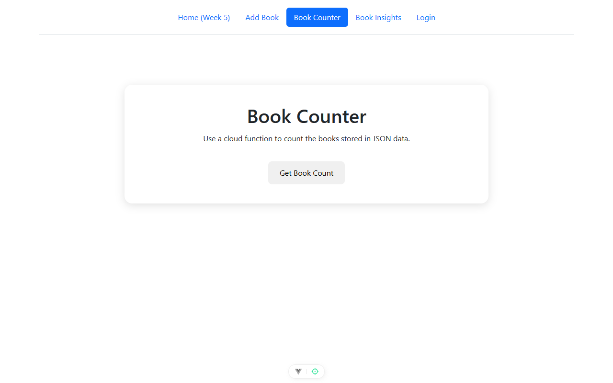
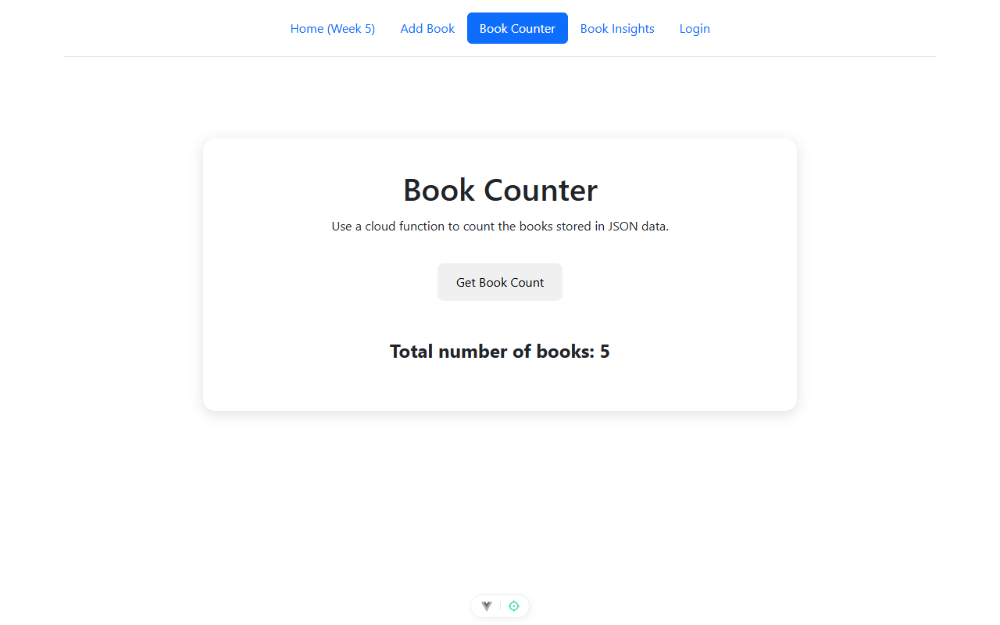
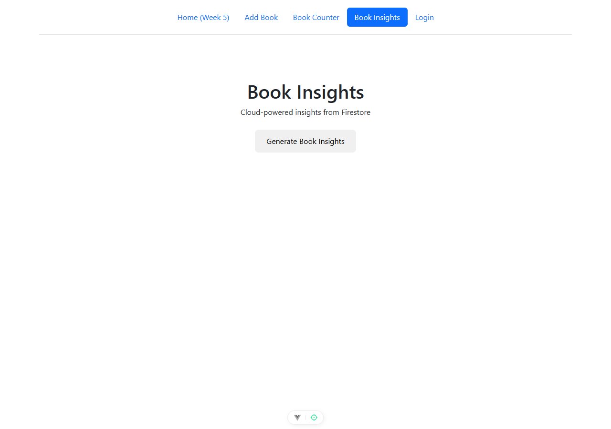
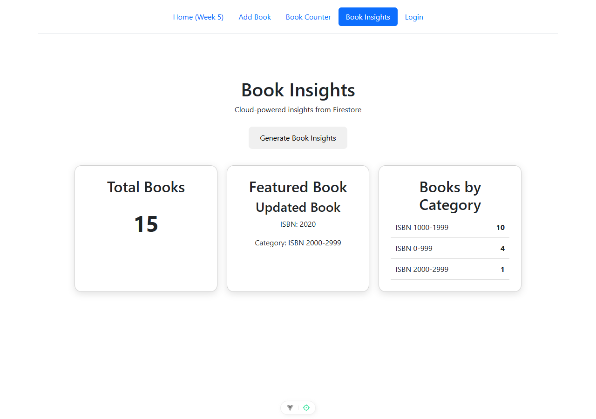

# FIT5032 Assessed Lab 9 — Mastering Cloud Functions

**Name:** _<your name>_ &nbsp;&nbsp; **Student ID:** _<your student id>_ &nbsp;&nbsp; **Tutorial:** _<your tutorial>_
**Repository:** https://github.com/rikey123123/rwang-library-lab5/tree/lab9-cloud-functions &nbsp;&nbsp; **Branch:** `lab9-cloud-functions`
**Submission Date:** _<date>_

---

## 1. Overview

I extended the NoMash Library project with two cloud functions, both deployed on **Alibaba Cloud Function Compute**. Task 9.1 counts books held in a JSON file bundled with the function. Task 9.2 reads the `books` collection created in Lab 8 from Cloud Firestore and returns aggregated figures that the Vue front end renders as a small dashboard.

```text
Task 9.1
books.json  →  Alibaba Function Compute: countBooks  →  HTTP  →  Vue + Axios
                                                                 "Total number of books: 5"

Task 9.2
Firestore / books (from Lab 8)  →  Alibaba Function Compute: bookInsights  →  HTTP  →  Vue
                                                                              Total + Featured Book + Categories
```

### Why both functions are on Alibaba Cloud

The unit requires a Chinese cloud platform, while the Task 9.2 rubric requires the data to come from **Firestore**. The rubric constrains where the *data* lives, not where the *function* runs, so I kept Firestore as the data source and deployed both functions to Alibaba Cloud Function Compute. This satisfies both requirements and avoids upgrading the Firebase project to the Blaze plan, which is mandatory for deploying Firebase Cloud Functions.

Firestore exposes a REST API, and a Function Compute instance has outbound internet access, so `bookInsights` can call `firestore.googleapis.com` directly.

| Item | Value |
| --- | --- |
| Cloud platform | Alibaba Cloud Function Compute |
| Region | `ap-southeast-1` (Singapore) |
| Runtime | Node.js 20 |
| Function type | Web function (long-lived HTTP server) |
| Authentication | No authentication (public read-only endpoints) |
| Firestore project | `nomash-library-lab7` |

Both function sources are committed under `cloud-functions/` in this branch, so the deployed code is version controlled rather than only living in the console.

---

## 2. Task 9.1 — countBooks

### 2.1 The data

`cloud-functions/countBooks/books.json` holds five books, so the expected result is unambiguous:

```json
[
  { "id": 1, "title": "The Hobbit", "author": "J. R. R. Tolkien" },
  { "id": 2, "title": "1984", "author": "George Orwell" },
  { "id": 3, "title": "The Great Gatsby", "author": "F. Scott Fitzgerald" },
  { "id": 4, "title": "Pride and Prejudice", "author": "Jane Austen" },
  { "id": 5, "title": "The Catcher in the Rye", "author": "J. D. Salinger" }
]
```

### 2.2 The function

The function is deployed as a **web function**, which means Function Compute starts the container with `npm run start` and expects the process to serve HTTP on the port it probes. The core logic is `books.length`; everything else is the HTTP server and the CORS headers the browser needs.

```js
const http = require('node:http')

const books = require('./books.json')

const PORT = Number(process.env.FC_SERVER_PORT || process.env.PORT || 9000)

const server = http.createServer((request, response) => {
  if (request.method === 'OPTIONS') {
    response.writeHead(204, corsHeaders())
    response.end()

    return
  }

  response.writeHead(200, {
    'Content-Type': 'application/json; charset=utf-8',
    ...corsHeaders()
  })
  response.end(JSON.stringify({ count: books.length }))
})

server.listen(PORT, '0.0.0.0', () => {
  console.log('countBooks listening on 0.0.0.0:' + PORT)
})
```

The `OPTIONS` branch matters because the browser sends a CORS preflight request before the real `GET`. Without it the Axios call from `localhost` fails before the function is ever invoked.

**Figure 1.** Alibaba Cloud Function Compute — the `countBooks` function detail page, showing the signed-in account and the Node.js 20 runtime.
> **Manual screenshot — instructions:** open Function Compute → Functions → `countBooks`. Make sure your account name/avatar in the top-right corner and the Node.js 20 runtime are both readable. Do **not** include any AccessKey, secret or billing detail.

```
[ PLACEHOLDER: Alibaba Cloud countBooks function detail page ]
```

**Figure 2.** The deployed function under test in the console, returning `{"count": 5}`.
> **Manual screenshot — instructions:** on the `countBooks` page, show the code (the `books.length` / `JSON.stringify({ count: books.length })` line visible) together with the result of **Test Function**, which should be `{"count": 5}`.

```
[ PLACEHOLDER: countBooks code + test result {"count": 5} ]
```

### 2.3 The HTTP endpoint

The function URL is configured with **no authentication**, so the browser can call it directly:

```text
https://countbooks-gdbniaqfld.ap-southeast-1.fcapp.run
```

Verified from the command line:

```text
$ curl -i https://countbooks-gdbniaqfld.ap-southeast-1.fcapp.run

HTTP/1.1 200 OK
access-control-allow-origin: *
access-control-allow-methods: GET, OPTIONS
content-type: application/json; charset=utf-8
Content-Disposition: attachment

{"count":5}
```

Two details worth recording. `Content-Disposition: attachment` is added by the default `fcapp.run` domain, which is why pasting the URL into a browser downloads a file instead of displaying the JSON — it does not affect the Axios call. And `access-control-allow-origin` appears exactly once, so Function Compute is not injecting a duplicate CORS header alongside the one the function sets.

### 2.4 The Vue page

`src/views/GetBookCountView.vue` calls the endpoint with Axios inside `try`/`catch`/`finally`, and `v-if` controls whether the result or the error is shown.

```js
const count = ref(null)
const error = ref('')
const loading = ref(false)

const functionUrl = 'https://countbooks-gdbniaqfld.ap-southeast-1.fcapp.run'

const getBookCount = async () => {
  try {
    loading.value = true
    error.value = ''

    const response = await axios.get(functionUrl)

    count.value = response.data.count
  } catch (err) {
    console.error(err)

    count.value = null
    error.value = 'Failed to get book count'
  } finally {
    loading.value = false
  }
}
```

The route `/book-counter` was added to `src/router/index.js` and a **Book Counter** link was added to the header, leaving the Lab 7 and Lab 8 routes untouched.

**Figure 3.** `GetBookCountView.vue` in VS Code — the Axios call to the Alibaba endpoint, `await axios.get(...)`, and the `try`/`catch` block.
> **Manual screenshot — instructions:** open `src/views/GetBookCountView.vue` in VS Code. Keep the filename visible in the tab, and make sure `import axios from 'axios'`, `const functionUrl = 'https://countbooks-...'` and the `await axios.get(functionUrl)` line are all on screen.

```
[ PLACEHOLDER: VS Code screenshot of GetBookCountView.vue ]
```

**Figure 4.** The Book Counter page before the cloud function is called — no result is rendered because `count` is still `null`.


**Figure 5.** After clicking **Get Book Count**, the page displays the value returned by the cloud function.


**Figure 6.** Browser DevTools Network tab showing the request to the Function Compute endpoint returning `200`.
> **Manual screenshot — instructions:** on `/book-counter`, open DevTools → Network, click **Get Book Count**, then select the `fcapp.run` request so the status `200` and the `{"count":5}` response body are visible.

```
[ PLACEHOLDER: DevTools Network showing 200 from fcapp.run ]
```

### 2.5 Verification

I drove the page with Playwright and captured both what was rendered and what crossed the network:

```text
rendered text : Total number of books: 5
matches "Total number of books: 5" : true
cloud function calls observed : 1
  1) GET -> 200  body={"count":5}
```

The rendered figure and the response body agree, which confirms the number on screen comes from the deployed cloud function rather than from anything hard-coded in the front end.

---

## 3. Task 9.2 — bookInsights

### 3.1 Approach

Rather than dumping the collection as raw JSON, the function computes three figures and the Vue page presents them as a dashboard: the **total** number of books, a **featured book**, and a **breakdown by category**.

```text
Firestore REST API  →  read books collection
                    →  total = number of documents
                    →  group documents into categories
                    →  featured book = highest ISBN (the most recent addition)
                    →  return JSON
```

### 3.2 How the categories are derived

The `books` collection created in Lab 8 stores exactly two fields per document: `isbn` (number) and `name` (string). There is no `category` or `author` field. Rather than invent data that is not in the database, the function derives each category from the ISBN band the book falls into — so a book with ISBN `1450` is grouped under `ISBN 1000-1999`. For the same reason the featured book is presented with its **ISBN** instead of an author.

This is a real computation over the real stored values, and it is stated here so the grouping is not mistaken for a stored field.

### 3.3 The function

```js
const PROJECT_ID = 'nomash-library-lab7'
const FIRESTORE_URL =
  'https://firestore.googleapis.com/v1/projects/' + PROJECT_ID +
  '/databases/(default)/documents/books?pageSize=300'

async function fetchBooks() {
  const response = await fetch(FIRESTORE_URL)

  if (!response.ok) {
    throw new Error('Firestore returned ' + response.status)
  }

  const payload = await response.json()
  const documents = payload.documents || []

  return documents.map((document) => {
    const fields = document.fields || {}

    return {
      name: fields.name ? fields.name.stringValue : 'Untitled',
      isbn: fields.isbn ? Number(fields.isbn.integerValue) : 0
    }
  })
}

function categoryOf(book) {
  const band = Math.floor(book.isbn / 1000) * 1000

  return 'ISBN ' + band + '-' + (band + 999)
}

function pickFeatured(books) {
  if (books.length === 0) {
    return null
  }

  const featured = books.reduce((best, book) => (book.isbn > best.isbn ? book : best))

  return { title: featured.name, isbn: featured.isbn, category: categoryOf(featured) }
}
```

Firestore's REST format wraps every value in a type tag, which is why the field access is `fields.name.stringValue` and `fields.isbn.integerValue` rather than a plain property read. Node.js 20 provides `fetch` globally, so the function has no npm dependencies.

The response shape is:

```json
{
  "total": 15,
  "categories": { "ISBN 1000-1999": 10, "ISBN 0-999": 4, "ISBN 2000-2999": 1 },
  "featuredBook": { "title": "Updated Book", "isbn": 2020, "category": "ISBN 2000-2999" }
}
```

A failure to reach Firestore is caught and returned as HTTP 500 with `{"error": "Failed to read the books collection"}`, so the front end shows its error state instead of hanging.

The deployed endpoint, again configured with no authentication:

```text
https://bookinsights-kabttjjdji.ap-southeast-1.fcapp.run
```

```text
$ curl -i https://bookinsights-kabttjjdji.ap-southeast-1.fcapp.run

HTTP/1.1 200 OK
content-type: application/json; charset=utf-8
access-control-allow-origin: *

{"total":15,
 "categories":{"ISBN 1000-1999":10,"ISBN 0-999":4,"ISBN 2000-2999":1},
 "featuredBook":{"title":"Updated Book","isbn":2020,"category":"ISBN 2000-2999"}}
```

The 15 documents are the books accumulated in the collection during Lab 8, and the featured book is `Updated Book` because ISBN `2020` — written by the Lab 8 update test — is the highest ISBN in the collection. Both figures come from Firestore, not from anything stored in the function.

### 3.4 Firestore access

The function reads Firestore anonymously over the REST API. This works because the `books` rule added in Lab 8 is still in test mode:

```
match /books/{bookId} {
  allow read, write: if true;
}
```

This is acceptable for an assessed lab with public, non-personal book data, but it is not appropriate for production. A real deployment should authenticate the function with a Google service account and tighten the rule so that only that identity can read the collection. The Lab 7 `users` rule is unchanged and still restricts access per user.

**Figure 7.** Firebase Console → Firestore Database → the `books` collection used as the data source, showing documents with `isbn` and `name`.
> **Manual screenshot — instructions:** open Firebase Console → project `nomash-library-lab7` → Firestore Database → Data → `books`. Show several documents so the `isbn` (number) and `name` (string) fields are readable.

```
[ PLACEHOLDER: Firestore books collection ]
```

**Figure 8.** Alibaba Cloud Function Compute — the `bookInsights` function and its code, with the signed-in account visible.
> **Manual screenshot — instructions:** open Function Compute → Functions → `bookInsights` → Code. Keep the Firestore URL, `categoryOf` and `pickFeatured` visible, along with your account in the top-right corner.

```
[ PLACEHOLDER: Alibaba Cloud bookInsights function code ]
```

**Figure 9.** The `bookInsights` function under test, returning the aggregated JSON read from Firestore.
> **Manual screenshot — instructions:** on the `bookInsights` page click **Test Function** and capture the response, so `total`, `categories` and `featuredBook` are all visible.

```
[ PLACEHOLDER: bookInsights test result JSON ]
```

### 3.5 The Vue dashboard

`src/views/BookInsightsView.vue` fetches the endpoint with Axios and renders three cards. `v-if="insights"` gates the dashboard, and the category breakdown is rendered with `v-for` over the returned object:

```html
<div
  v-for="(amount, category) in insights.categories"
  :key="category"
  class="category-row"
>
  <span>{{ category }}</span>
  <strong>{{ amount }}</strong>
</div>
```

The route `/book-insights` was added to the router and a **Book Insights** link to the header.

**Figure 10.** The Book Insights page before the cloud function is called.


**Figure 11.** The Book Insights dashboard showing the total, the featured book and the category breakdown produced by the cloud function.


### 3.6 Verification

Driving the page with Playwright and comparing what was rendered against what crossed the network:

```text
Total Books card      : 15
card: Total Books
card: Featured Book
card: Books by Category
Featured title        : Updated Book
category rows         : 3
  ISBN 1000-1999  10
  ISBN 0-999      4
  ISBN 2000-2999  1
cloud function calls  : 1
  1) GET 200  {"total":15,"categories":{"ISBN 1000-1999":10,"ISBN 0-999":4,
               "ISBN 2000-2999":1},"featuredBook":{"title":"Updated Book",
               "isbn":2020,"category":"ISBN 2000-2999"}}
```

Every value on screen matches the response body: the total, the featured title, and all three category rows with their counts. The chain from Firestore through the cloud function to the rendered dashboard is therefore confirmed end to end.

---

## 4. Problems encountered and how they were fixed

These are the failures that actually occurred while deploying, and what each one turned out to be.

| Symptom | Cause | Fix |
| --- | --- | --- |
| `400 MissingRequiredHeader: required HTTP header Date was not specified`, then `InvalidArgument: invalid authorization ''` | The function URL was created with **signature authentication**. A browser cannot sign an Alibaba Cloud request, so Axios could never succeed. This happened for both functions, since it is the console default. | Changed the trigger's authentication mode to **no authentication**. |
| `412 CAExited: Function instance exited unexpectedly (code 0) with start command 'npm run start'` | The function was created as a **web function**, but the code exported `exports.handler`. Node ran the file, exported a function and exited, because nothing kept the process alive. A web function must serve HTTP itself. | Rewrote the function as an HTTP server started with `http.createServer(...).listen(...)`. |
| Same `CAExited` after redeploying through the console editor | The edit had not reached the code that actually runs — the startup log still showed the previous package name. | Deployed a ZIP built from the version-controlled sources, which changed the logged package name and confirmed the upload took effect. |
| No startup output in the logs | Nothing distinguished "did not start" from "started but was unreachable". | Added startup logging (`node` version, port, book count) and bound explicitly to `0.0.0.0` so the platform health check can reach the port over IPv4. |

The last two changes are why `index.js` logs on startup: it makes the difference between a process that never ran and a process the platform could not reach visible in the console log.

---

## 5. Status

Both tasks are complete and verified end to end.

| Task | Endpoint | Verified result |
| --- | --- | --- |
| 9.1 `countBooks` | `https://countbooks-gdbniaqfld.ap-southeast-1.fcapp.run` | `{"count":5}` → page shows `Total number of books: 5` |
| 9.2 `bookInsights` | `https://bookinsights-kabttjjdji.ap-southeast-1.fcapp.run` | `total: 15`, 3 categories, featured `Updated Book` → dashboard matches |

In both cases the value rendered in the browser was compared against the response body observed on the network, so the figures on screen demonstrably come from the deployed cloud functions rather than from front-end state.

One limitation worth recording: the `bookInsights` Firestore read could not be exercised on the development machine, because this machine cannot reach `firestore.googleapis.com`. Locally the function was confirmed to start, answer the CORS preflight with `204`, and return a clean `500` with the expected error JSON when the Firestore call fails. The successful read was verified only against the deployed function, which does have outbound internet access.


---

## 6. Files changed in this branch

| File | Purpose |
| --- | --- |
| `cloud-functions/countBooks/index.js` | Task 9.1 web function — counts the books in `books.json` |
| `cloud-functions/countBooks/books.json` | The five-book JSON dataset |
| `cloud-functions/countBooks/package.json` | `npm start` entry point for the web function |
| `cloud-functions/bookInsights/index.js` | Task 9.2 web function — reads Firestore and aggregates |
| `cloud-functions/bookInsights/package.json` | `npm start` entry point for the web function |
| `src/views/GetBookCountView.vue` | Book Counter page (Axios, `try`/`catch`, `v-if`) |
| `src/views/BookInsightsView.vue` | Book Insights dashboard (`v-if`, `v-for`) |
| `src/router/index.js` | Added the `/book-counter` and `/book-insights` routes |
| `src/components/BHeader.vue` | Added the Book Counter and Book Insights navigation links |
