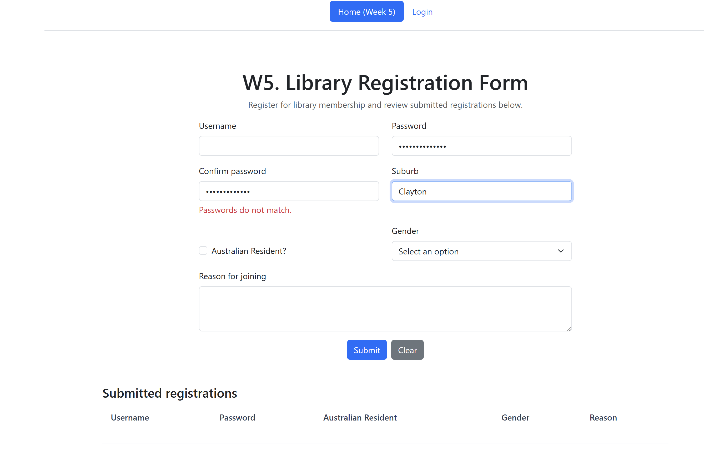
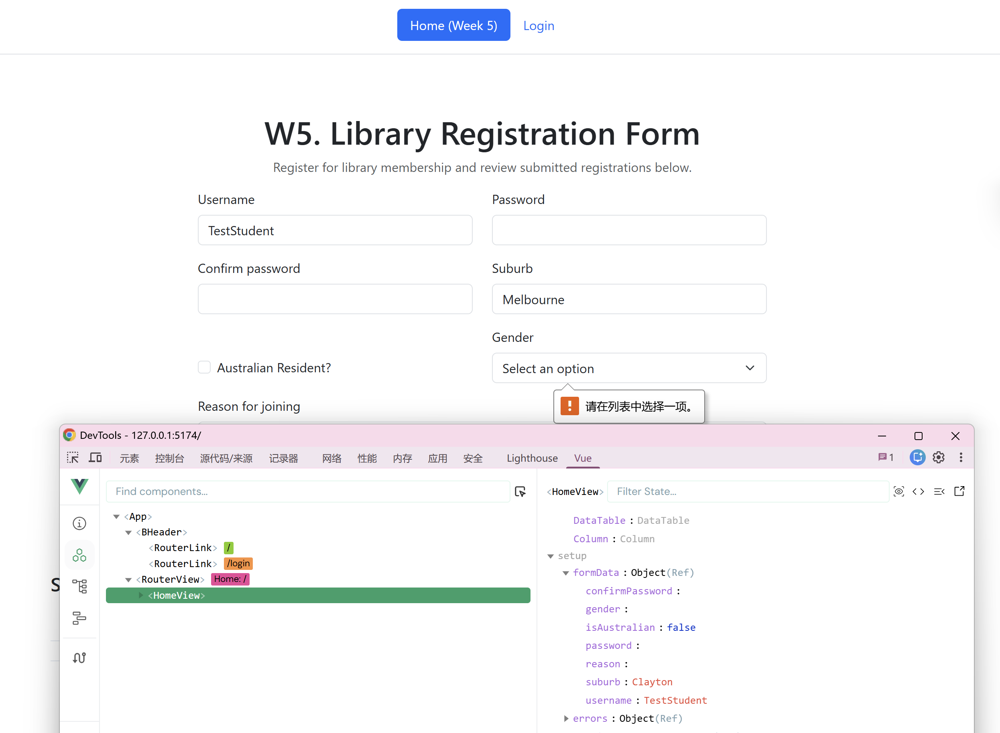
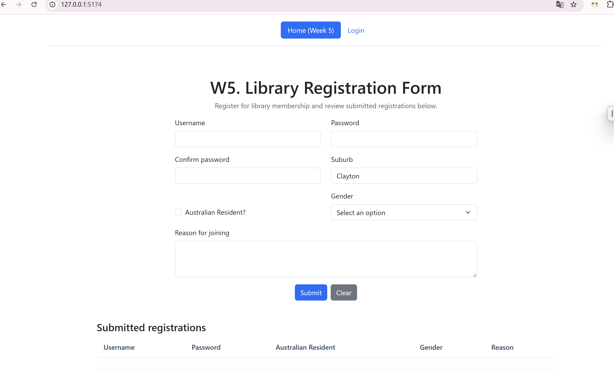
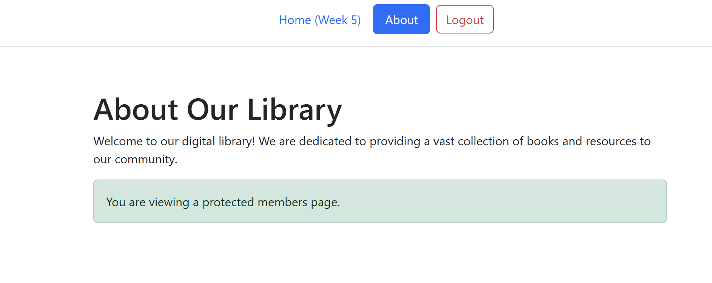
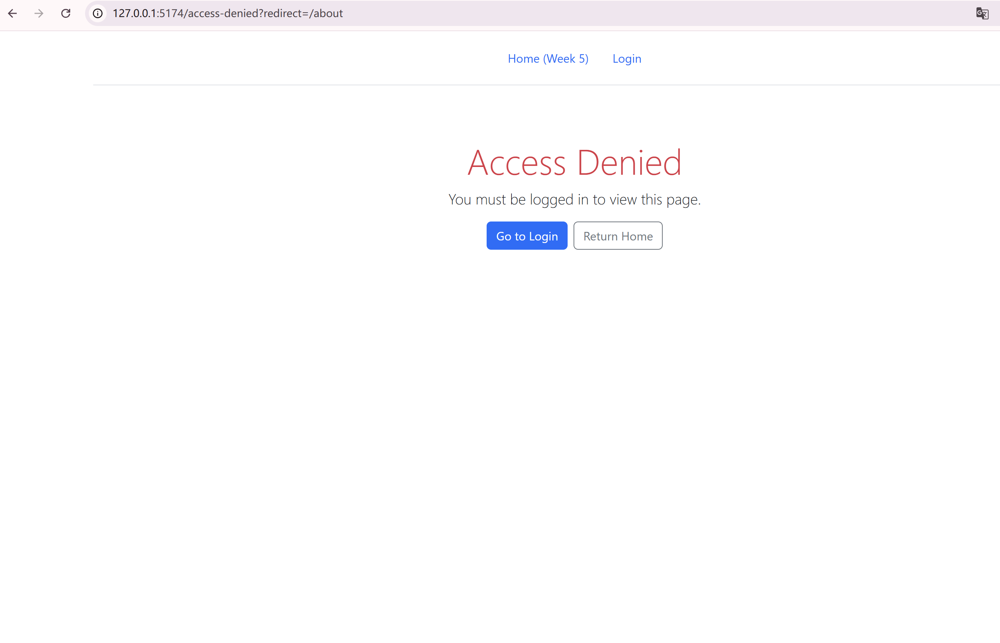
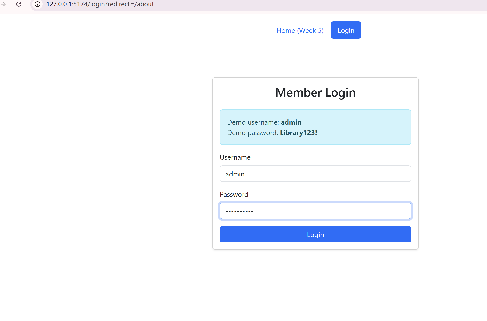
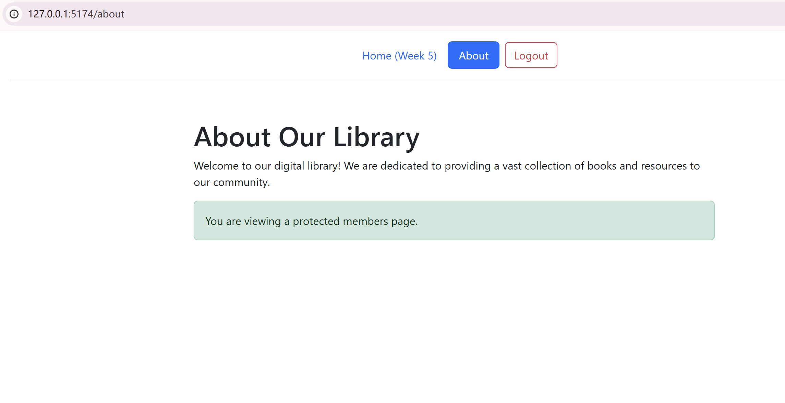

# FIT5032 Assessed Lab 5 Report

**Student name:** Ruiqi Wang<br>
**Student ID:**  36668095

---

## 1. Introduction

This report documents the implementation and testing of a Vue 3 library registration application. The Week 4 starter project was extended with password confirmation validation, reactive data-binding testing, Vue Router navigation, and a simple protected-route authentication flow.

The work was completed from the course repository's `week-4-end`鈥?branch on the dedicated `assessed-lab-5`鈥?working branch. The application was verified with a successful `npm run build` before evidence was collected.

---

## 2. Task 5.1: Password Confirmation Validation

The registration form stores `password`鈥?and `confirmPassword`鈥?as separate reactive properties. When the confirmation field loses focus, `validateConfirmPassword(true)`鈥?checks for an empty value and then verifies that the two passwords are identical. The validation result uses the independent `errors.confirmPassword` property, preventing it from overwriting password-strength feedback.

The following test used a valid password and an intentionally different confirmation password. The error message demonstrates that the validation is working.

### Screenshot 1: Password Confirmation Validation



---

## 3. Task 5.1: Vue DevTools Data Binding Test

The form provides two contrasting binding examples.

|Field|Binding|Expected result|
| ----------| ---------| ---------------------------------------------------------------------------------------|
|Username|`v-model="formData.username"`|Editing the input immediately updates `formData.username`; changing component state updates the input.|
|Suburb|`:value="formData.suburb"`|The initial `Clayton`鈥?value is displayed, but editing the field does not write back to `formData.suburb`.|

For testing, Username was set to `TestStudent`鈥?and the displayed Suburb value was changed from `Clayton`鈥?to `Melbourne`鈥? In Vue DevTools, `HomeView`鈥?should show `username: "TestStudent"`鈥?and `suburb: "Clayton"`. This confirms two-way binding for Username and one-way binding for Suburb.

### Screenshot 2: Testing Data Binding with Vue DevTools



---

## 4. Router Implementation

Vue Router provides client-side navigation without a complete browser-page reload. The application uses `createWebHistory()`鈥?and renders route components through `<router-view />`鈥?in `App.vue`.

|Path|Route name|Component|Access rule|
| ------| ------------| -----------| -----------------------------------------------------|
|`/`|`Home`|`HomeView`|Public|
|`/about`|`About`|`AboutView`|Requires authentication|
|`/login`|`Login`|`LoginView`|Public; authenticated users are redirected to About|
|`/access-denied`|`AccessDenied`|`AccessDeniedView`|Public|
|`/:pathMatch(.*)*`|N/A|N/A|Redirects to Home|

The global navigation guard checks `to.meta.requiresAuth`鈥? When the target route requires authentication and `isAuthenticated.value`鈥?is false, the guard redirects to Access Denied and retains the originally requested path in the `redirect` query parameter. A successful login returns the user to that requested path.

### File: `src/router/index.js`

```js
import { createRouter, createWebHistory } from 'vue-router'

import HomeView from '../views/HomeView.vue'
import AboutView from '../views/AboutView.vue'
import LoginView from '../views/LoginView.vue'
import AccessDeniedView from '../views/AccessDeniedView.vue'
import { isAuthenticated } from '../auth'

const routes = [
  { path: '/', name: 'Home', component: HomeView },
  {
    path: '/about',
    name: 'About',
    component: AboutView,
    meta: { requiresAuth: true }
  },
  { path: '/login', name: 'Login', component: LoginView },
  { path: '/access-denied', name: 'AccessDenied', component: AccessDeniedView },
  { path: '/:pathMatch(.*)*', redirect: '/' }
]

const router = createRouter({
  history: createWebHistory(),
  routes
})

router.beforeEach((to) => {
  if (to.meta.requiresAuth && !isAuthenticated.value) {
    return {
      name: 'AccessDenied',
      query: { redirect: to.fullPath }
    }
  }

  if (to.name === 'Login' && isAuthenticated.value) {
    return { name: 'About' }
  }

  return true
})

export default router
```

### File: `src/App.vue`

```vue
<script setup>
import BHeader from './components/BHeader.vue'
</script>

<template>
  <div class="app-shell">
    <header>
      <BHeader />
    </header>
    <main class="container py-4">
      <router-view />
    </main>
  </div>
</template>

<style>
.app-shell {
  min-height: 100vh;
  font-family: 'Segoe UI', Tahoma, Geneva, Verdana, sans-serif;
}

main.container {
  max-width: 1200px;
}
</style>
```

---

## 5. Home View Implementation

`HomeView.vue` is the registration-form route. It retains the Bootstrap layout and PrimeVue DataTable from the starter project, while adding the required reactive state and event handlers.

- `formData.confirmPassword`鈥?is bound to Confirm password with `v-model`.
- `validateConfirmPassword(true)`鈥?runs on blur and during `submitForm()`.
- `clearForm()`鈥?resets the form, errors, feedback, and Suburb value of `Clayton`.
- `validateReason()`鈥?uses `/\bfriend\b/i`鈥?to recognise the whole word `friend` regardless of case.
- Suburb uses `:value="formData.suburb"` deliberately to demonstrate one-way binding.
- `confirmPassword` is omitted before a valid submitted user is stored in the DataTable or card list.

### File: `src/views/HomeView.vue`

```vue
<script setup>
import { ref } from 'vue'
import DataTable from 'primevue/datatable'
import Column from 'primevue/column'

const emptyFormData = () => ({
  username: '',
  password: '',
  confirmPassword: '',
  isAustralian: false,
  reason: '',
  gender: '',
  suburb: 'Clayton'
})

const emptyErrors = () => ({
  username: null,
  password: null,
  confirmPassword: null,
  resident: null,
  gender: null,
  reason: null
})

const formData = ref(emptyFormData())
const errors = ref(emptyErrors())
const submittedCards = ref([])
const reasonFeedback = ref('')

const validateName = (blur) => {
  if (formData.value.username.length < 3) {
    if (blur) {
      errors.value.username = 'Name must be at least 3 characters.'
    }
    return
  }

  errors.value.username = null
}

const validatePassword = (blur) => {
  const password = formData.value.password
  const minLength = 8
  const hasUppercase = /[A-Z]/.test(password)
  const hasLowercase = /[a-z]/.test(password)
  const hasNumber = /\d/.test(password)
  const hasSpecialChar = /[!@#$%^&*(),.?":{}|<>]/.test(password)

  if (password.length < minLength) {
    if (blur) {
      errors.value.password = `Password must be at least ${minLength} characters long.`
    }
  } else if (!hasUppercase) {
    if (blur) {
      errors.value.password = 'Password must contain at least one uppercase letter.'
    }
  } else if (!hasLowercase) {
    if (blur) {
      errors.value.password = 'Password must contain at least one lowercase letter.'
    }
  } else if (!hasNumber) {
    if (blur) {
      errors.value.password = 'Password must contain at least one number.'
    }
  } else if (!hasSpecialChar) {
    if (blur) {
      errors.value.password = 'Password must contain at least one special character.'
    }
  } else {
    errors.value.password = null
  }
}

const validateConfirmPassword = (blur) => {
  const password = formData.value.password
  const confirmPassword = formData.value.confirmPassword

  if (!confirmPassword) {
    if (blur) {
      errors.value.confirmPassword = 'Please confirm your password.'
    }
  } else if (password !== confirmPassword) {
    if (blur) {
      errors.value.confirmPassword = 'Passwords do not match.'
    }
  } else {
    errors.value.confirmPassword = null
  }
}

const validateReason = () => {
  const containsFriend = /\bfriend\b/i.test(formData.value.reason)
  reasonFeedback.value = containsFriend ? 'Great to have a friend' : ''
}

const submitForm = () => {
  validateName(true)
  validatePassword(true)
  validateConfirmPassword(true)

  const formIsValid =
    !errors.value.username &&
    !errors.value.password &&
    !errors.value.confirmPassword

  if (formIsValid) {
    const { confirmPassword, ...submittedUser } = formData.value
    submittedCards.value.push(submittedUser)
    clearForm()
  }
}

const clearForm = () => {
  formData.value = emptyFormData()
  errors.value = emptyErrors()
  reasonFeedback.value = ''
}
</script>

<template>
  <section class="container mt-5 registration-page">
    <div class="row">
      <div class="col-md-8 offset-md-2">
        <h1 class="text-center">W5. Library Registration Form</h1>
        <p class="text-center text-muted">
          Register for library membership and review submitted registrations below.
        </p>

        <form @submit.prevent="submitForm">
          <div class="row mb-3">
            <div class="col-md-6 col-sm-6">
              <label for="username" class="form-label">Username</label>
              <input
                id="username"
                v-model="formData.username"
                type="text"
                class="form-control"
                @blur="() => validateName(true)"
                @input="() => validateName(false)"
              />
              <div v-if="errors.username" class="text-danger mt-1">
                {{ errors.username }}
              </div>
            </div>

            <div class="col-md-6 col-sm-6">
              <label for="password" class="form-label">Password</label>
              <input
                id="password"
                v-model="formData.password"
                type="password"
                class="form-control"
                @blur="() => validatePassword(true)"
                @input="() => validatePassword(false)"
              />
              <div v-if="errors.password" class="text-danger mt-1">
                {{ errors.password }}
              </div>
            </div>
          </div>

          <div class="row mb-3">
            <div class="col-md-6 col-sm-6">
              <label for="confirm-password" class="form-label">Confirm password</label>
              <input
                id="confirm-password"
                v-model="formData.confirmPassword"
                type="password"
                class="form-control"
                @blur="() => validateConfirmPassword(true)"
                @input="() => validateConfirmPassword(false)"
              />
              <div v-if="errors.confirmPassword" class="text-danger mt-1">
                {{ errors.confirmPassword }}
              </div>
            </div>

            <div class="col-md-6 col-sm-6">
              <label for="suburb" class="form-label">Suburb</label>
              <input
                id="suburb"
                :value="formData.suburb"
                type="text"
                class="form-control"
              />
            </div>
          </div>

          <div class="row mb-3">
            <div class="col-md-6 col-sm-6 d-flex align-items-end">
              <div class="form-check mb-2">
                <input
                  id="isAustralian"
                  v-model="formData.isAustralian"
                  type="checkbox"
                  class="form-check-input"
                />
                <label class="form-check-label" for="isAustralian">Australian Resident?</label>
              </div>
            </div>

            <div class="col-md-6 col-sm-6">
              <label for="gender" class="form-label">Gender</label>
              <select id="gender" v-model="formData.gender" class="form-select" required>
                <option disabled value="">Select an option</option>
                <option value="male">Male</option>
                <option value="female">Female</option>
                <option value="other">Other</option>
              </select>
            </div>
          </div>

          <div class="mb-3">
            <label for="reason" class="form-label">Reason for joining</label>
            <textarea
              id="reason"
              v-model="formData.reason"
              class="form-control"
              rows="3"
              @input="validateReason"
            ></textarea>
            <div v-if="reasonFeedback" class="text-success mt-1">
              {{ reasonFeedback }}
            </div>
          </div>

          <div class="text-center">
            <button type="submit" class="btn btn-primary me-2">Submit</button>
            <button type="button" class="btn btn-secondary" @click="clearForm">Clear</button>
          </div>
        </form>
      </div>
    </div>

    <div class="row mt-5">
      <div class="col-12">
        <h2 class="h4">Submitted registrations</h2>
        <DataTable :value="submittedCards" table-style="min-width: 50rem">
          <Column field="username" header="Username" />
          <Column field="password" header="Password" />
          <Column field="isAustralian" header="Australian Resident" />
          <Column field="gender" header="Gender" />
          <Column field="reason" header="Reason" />
        </DataTable>
      </div>
    </div>

    <div v-if="submittedCards.length" class="row mt-4">
      <div class="col-12 d-flex flex-wrap justify-content-start">
        <article v-for="(card, index) in submittedCards" :key="index" class="card m-2 user-card">
          <div class="card-header">User Information</div>
          <ul class="list-group list-group-flush">
            <li class="list-group-item">Username: {{ card.username }}</li>
            <li class="list-group-item">Password: {{ card.password }}</li>
            <li class="list-group-item">
              Australian Resident: {{ card.isAustralian ? 'Yes' : 'No' }}
            </li>
            <li class="list-group-item">Gender: {{ card.gender }}</li>
            <li class="list-group-item">Reason: {{ card.reason }}</li>
          </ul>
        </article>
      </div>
    </div>
  </section>
</template>

<style scoped>
.registration-page {
  max-width: 1100px;
  padding-bottom: 3rem;
}

.user-card {
  width: 18rem;
}
</style>

```

---

## 6. Localhost Evidence: Home Page

The public Home route displays the navigation header, active Home link, complete Library Registration Form, Confirm password field, and submitted-registration DataTable.

### Localhost - Home Page



---

## 7. Protected About Page

The About page is a protected members page. It becomes available only after successful authentication. When authentication succeeds, the Header reacts by showing the active About link and a Logout button.

### Localhost - About Page After Successful Login



---

## 8. Custom Routing and Authentication Guard

The demonstration credentials are:

```text
Username: admin
Password: Library123!
```

### 8.1 Unauthenticated Access

When a user who is not logged in requests `/about`鈥? the guard blocks the route and redirects to Access Denied. The original requested route is retained so that the user can return to `/about` after login.

### Custom Routing - Unauthenticated Access



### 8.2 Successful Login and Redirect

`LoginView`鈥?calls `login()`鈥?from `auth.js`鈥?when the correct credentials are entered. The function updates reactive `isAuthenticated`鈥?state and saves the state to `sessionStorage`. The Login view returns the user to the requested protected route. The Header changes from Login to About and Logout without a page reload.

### Custom Routing - Successful Login





---

## 9. Testing Results

|Test|Procedure|Expected result|Result|
| ------------------------| --------------------------------------------------| ----------------------------------------------------| --------|
|Password mismatch|Enter `HelloWorld123%`鈥?and `HelloWorld123`, then blur Confirm password.|Red `Passwords do not match.` appears.|Pass|
|Confirmation on submit|Submit without a matching confirmation password.|Submission is prevented and an error appears.|Pass|
|Reason feedback|Enter `My friend recommended this library.`|Green `Great to have a friend` appears.|Pass|
|One-way binding|Change displayed Suburb from `Clayton`鈥?to `Melbourne`.|DevTools state remains `suburb: "Clayton"`.|Pass|
|Two-way binding|Enter `TestStudent` in Username.|DevTools shows `username: "TestStudent"`.|Pass|
|Unauthenticated route|Clear session storage and request `/about`.|Access Denied page is shown.|Pass|
|Invalid login|Submit incorrect credentials.|Error appears and user remains on Login.|Pass|
|Valid login|Submit `admin`鈥?/ `Library123!`.|User is redirected to About.|Pass|
|Session persistence|Refresh authenticated About in the same tab.|Authentication remains active.|Pass|
|Logout|Select Logout and request `/about` again.|User returns to Login and About remains protected.|Pass|
|Production build|Run `npm run build`.|Vite completes and creates `dist/`.|Pass|
